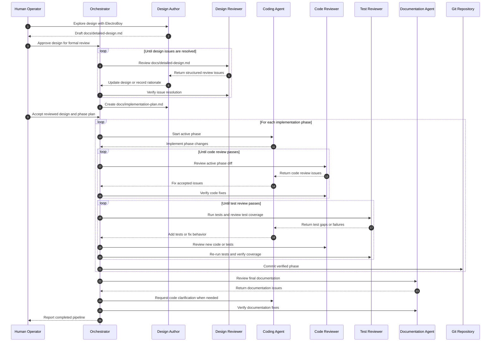

# AI Agent Pipeline Detailed Design

## Purpose

This project defines an agent pipeline for moving from a human-guided design
conversation to reviewed, tested, documented implementation work. The workflow
keeps the early creative design process interactive and automates the repeatable
work of review, code production, test assessment, and documentation
verification.

The pipeline is built around a small set of specialized agents. Each agent has a
narrow responsibility, a defined set of inputs, and a controlled authority over
project artifacts. Reviews move through structured issue records so that agents
iterate without losing context or reopening settled decisions accidentally.

## Design Approach

The workflow separates creative design from mechanical execution. Independent
review agents handle design, code, tests, and documentation. Implementation
proceeds through bounded phases so that each unit of work is reviewed, tested,
and committed before the next unit begins.

The design controls coordination drift by using versioned artifacts and
machine-readable run state. It keeps authority clear by giving each agent a
narrow ownership boundary. Review loops terminate through explicit issue
severity, acceptance, rejection, deferral, escalation, and verification rules.

The human operator remains the final authority for design intent and disputed
tradeoffs. Automated agents perform the repeatable work inside those boundaries.

## Workflow Overview

A sequence diagram is the most useful first view of the pipeline because the
core behavior is a set of handoffs between specialized agents. A state diagram
is better suited for the gate state machine and can be added when the
orchestrator state model is specified in more detail.



## Goals

- Preserve the human-led design process with ElectroBoy as the primary design
  collaborator.
- Convert an approved design into a detailed implementation strategy with small,
  reviewable phases.
- Run design review, code review, and test review as separate loops with clear
  completion gates.
- Require each implementation phase to be coded, reviewed, tested, and committed
  before the next phase begins.
- Keep documentation synchronized with the final codebase.
- Produce enough persistent state for interrupted agent runs to resume without
  guessing.

## Non-Goals

- The pipeline does not automate the early exploratory design conversation.
- The pipeline does not let every agent edit every artifact.
- The pipeline does not merge unrelated phases into one large implementation
  pass.
- The pipeline does not treat a passing test suite as proof that tests are
  comprehensive.
- The pipeline does not replace human judgment for disputed architecture
  decisions.

## Core Artifacts

The pipeline revolves around a small number of durable files.

### `docs/detailed-design.md`

This file describes the target system. The design author agent owns updates
during the design review loop. The documentation agent later verifies that the
final code still matches it.

### `docs/implementation-plan.md`

This file breaks the approved design into implementation phases. Each phase
includes scope, expected files or modules, acceptance criteria, test
expectations, and dependency notes.

### `README.md`

The README describes how to clone, build, configure, test, and operate the
codebase. It is written for a new contributor or operator.

### `docs/api.md`

This file describes the public API exposed by the codebase. It includes public
functions, classes, commands, configuration files, data formats, extension
points, and stable behavior guarantees.

### Agent State Directory

The pipeline stores machine-readable state under `.agent-pipeline/`.

Directory layout:

```text
.agent-pipeline/
  runs/
    <run-id>/
      manifest.json
      design-review.jsonl
      phase-<n>-code-review.jsonl
      phase-<n>-test-review.jsonl
      documentation-review.jsonl
  phase-status.json
  decisions.jsonl
```

The files in this directory capture review issues, decisions, phase status, and
run metadata. They are not a substitute for the source documents. They give the
orchestrator and agents a reliable way to resume work and audit past decisions.

## Agent Roles

### A. Design Author Agent

The design author agent is the original design collaborator. In this project
that role is ElectroBoy.

Responsibilities:

- Collaborate with the human operator during the exploratory design stage.
- Write and revise `docs/detailed-design.md`.
- Respond to design review comments from the design review agent.
- Record accepted design changes in the design document.
- Explain rejected review comments with a concrete rationale.

Authority:

- Edits `docs/detailed-design.md`.
- Proposes updates to `docs/implementation-plan.md` when a design change affects
  phase structure.
- Does not edit production code during design review.

### B. Design Review Agent

The design review agent challenges the design before implementation begins.

Responsibilities:

- Review the design for ambiguity, missing requirements, inconsistent
  assumptions, operational gaps, testability problems, security risks, and
  implementation hazards.
- Produce structured review issues for the design author agent.
- Verify that design changes resolve review issues.
- Distinguish required fixes from optional improvements.

Authority:

- Creates and updates design review issue records.
- Suggests text, diagrams, and acceptance criteria.
- Does not directly edit `docs/detailed-design.md`.

### C. Coding Agent

The coding agent implements the approved plan one phase at a time.

Responsibilities:

- Read the approved detailed design and implementation plan before each phase.
- Implement only the active phase scope.
- Add or update tests requested by the implementation plan or test review agent.
- Address code review findings.
- Commit each completed phase after review and test gates pass.

Authority:

- Edits production code, tests, build files, and developer documentation within
  the active phase.
- Edits `README.md` or `docs/api.md` when the active phase changes usage or
  public API details.
- Does not modify the approved design unless the orchestrator sends the work
  back through the design loop.

### D. Code Review Agent

The code review agent reviews each phase after the coding agent completes the
implementation pass.

Responsibilities:

- Review diffs against the active phase scope and the approved design.
- Identify correctness bugs, maintainability problems, security issues, API
  inconsistencies, missing error handling, and risky deviations from local
  project style.
- Produce structured review issues for the coding agent.
- Verify fixes before the phase proceeds.

Authority:

- Creates and updates code review issue records.
- Requests code changes and test changes.
- Does not directly edit implementation files.

### E. Test Review Agent

The test review agent evaluates both test execution and test quality.

Responsibilities:

- Run the project test suite.
- Inspect existing tests for coverage of phase acceptance criteria, edge cases,
  failure modes, integration paths, and regression risk.
- Propose new or revised tests when coverage is weak.
- Re-run tests after the coding agent implements requested tests.
- Verify that the test suite gives meaningful confidence for the active phase.

Authority:

- Creates and updates test review issue records.
- Requests tests from the coding agent.
- Does not directly edit test files.

### F. Documentation Agent

The documentation agent verifies final documentation after implementation work
is complete.

Responsibilities:

- Compare `docs/detailed-design.md` with the implemented code.
- Ensure `README.md` explains clone, build, configuration, test, and normal
  usage workflows.
- Ensure `docs/api.md` documents the public API in enough detail for a
  downstream user or contributor.
- Produce documentation review issues when code and docs diverge.
- Verify documentation fixes before the project is considered complete.

Authority:

- Edits documentation files.
- Requests code clarification from the coding agent when the implementation is
  ambiguous.
- Does not change production behavior.

## Orchestrator

The orchestrator coordinates agents, artifacts, and phase gates. The baseline
implementation is a local CLI-driven workflow. Its essential job is to enforce
order and preserve state.

Responsibilities:

- Assign the active stage and active implementation phase.
- Provide each agent with the correct context bundle.
- Store review issues in the agent state directory.
- Prevent coding work before design review is complete.
- Prevent a phase commit before code review and test review are complete.
- Halt and request human input when agents disagree about design intent or
  scope.
- Record decisions that affect future phases.

The orchestrator treats each agent response as an input to a state transition.
Durable artifacts and run state are the source of truth.

## Pipeline Stages

### Stage 1. Human-Led Design Exploration

The human operator works with ElectroBoy to explore the design. This stage
remains interactive and intentionally flexible. The output is a coherent draft
of `docs/detailed-design.md`.

Exit criteria:

- The human operator approves the design draft for formal review.
- The design describes user goals, architecture, responsibilities, workflows,
  data flow, operational expectations, and known constraints.

### Stage 2. Automated Design Review

The design review agent reviews `docs/detailed-design.md` and creates design
review issues. The design author agent updates the document or responds with a
rejection rationale.

The loop continues until every required issue is verified, downgraded, or
escalated to the human operator.

Exit criteria:

- No open blocker or major design review issues remain.
- Minor issues are either fixed or explicitly deferred.
- Any disputed design decisions are recorded in
  `.agent-pipeline/decisions.jsonl`.
- The human operator accepts the reviewed design.

### Stage 3. Implementation Strategy

The approved design is converted into `docs/implementation-plan.md`. The plan
divides work into small phases that are coded, reviewed, tested, and committed
independently.

Each phase includes:

- Objective.
- Scope.
- Out-of-scope items.
- Expected files or modules.
- Acceptance criteria.
- Required tests.
- Public API or documentation impact.
- Dependencies on earlier phases.

Exit criteria:

- Every phase has a bounded scope.
- Dependencies between phases are explicit.
- The first phase begins without unresolved design questions.

### Stage 4. Phase Implementation Loop

The coding agent implements one phase from `docs/implementation-plan.md`.

The basic loop is:

1. The coding agent implements the active phase.
2. The code review agent reviews the implementation.
3. The coding agent fixes accepted review issues.
4. The code review agent verifies the fixes.
5. The test review agent runs tests and evaluates test completeness.
6. The coding agent implements requested tests or fixes.
7. The code review agent reviews any new code or tests.
8. The test review agent re-runs tests and verifies coverage.
9. The coding agent commits the phase after all gates pass.

The next phase starts only after the current phase commit exists.

Exit criteria for each phase:

- All blocker and major code review issues are resolved.
- All blocker and major test review issues are resolved.
- Required tests pass.
- The implementation matches the phase acceptance criteria.
- Documentation touched by the phase is updated when needed.
- The phase commit is created with a clear commit message.

### Stage 5. Final Documentation Review

The documentation agent reviews the completed codebase and documentation.

The documentation pass verifies three levels of documentation:

- `docs/detailed-design.md` accurately describes the implemented architecture.
- `README.md` explains clone, build, configuration, test, and usage workflows.
- `docs/api.md` documents the public API and stable behavior.

Exit criteria:

- No blocker or major documentation review issues remain.
- Public API documentation matches the code.
- The README is complete enough for a new contributor to follow successfully.
- Design documentation reflects the final implementation.

## Review Issue Format

Every review comment is stored as a structured issue. A consistent format lets
agents verify fixes and prevents duplicate findings from drifting across
iterations.

Issue fields:

```json
{
  "id": "DESIGN-001",
  "stage": "design-review",
  "phase": null,
  "severity": "major",
  "status": "open",
  "owner": "design-author",
  "artifact": "docs/detailed-design.md",
  "location": "Section name or file:line",
  "summary": "The design does not define how review loops terminate.",
  "rationale": "Without exit criteria the automated pipeline cycles indefinitely.",
  "requested_change": "Add loop termination criteria for each review stage.",
  "response": null,
  "verification": null
}
```

Severity values:

- `blocker` means the stage cannot proceed.
- `major` means the stage cannot proceed without a fix or human waiver.
- `minor` means the issue is fixed when practical.
- `nit` means the issue is cosmetic or editorial.

Status values:

- `open` means the issue needs action.
- `accepted` means the responsible agent agrees and is working on it.
- `fixed` means the responsible agent claims the issue is addressed.
- `verified` means the reviewing agent confirms the fix.
- `rejected` means the responsible agent disagrees and has provided a rationale.
- `deferred` means the issue is intentionally moved outside the current stage.
- `escalated` means human input is required.

## Context Bundles

Each agent receives only the context needed for its role, plus enough shared
state to avoid contradictory work.

### Design Author Context

- Current `docs/detailed-design.md`.
- Open design review issues.
- Relevant decisions from `.agent-pipeline/decisions.jsonl`.
- Human instructions and constraints.

### Design Reviewer Context

- Current `docs/detailed-design.md`.
- Prior design review issues.
- Relevant decisions.
- Target implementation constraints.

### Coding Agent Context

- Approved `docs/detailed-design.md`.
- `docs/implementation-plan.md`.
- Active phase definition.
- Open code review and test review issues for the phase.
- Current repository state.

### Code Reviewer Context

- Approved design.
- Active phase definition.
- Diff for the active phase.
- Prior review issues for the phase.
- Project style and test conventions.

### Test Reviewer Context

- Approved design.
- Active phase definition.
- Current test suite.
- Test outputs.
- Relevant diffs.

### Documentation Agent Context

- Final codebase.
- `docs/detailed-design.md`.
- `README.md`.
- `docs/api.md`.
- Implementation plan and phase commits.

## Phase Gate Rules

The pipeline enforces gates with explicit checks.

Design gate:

- `docs/detailed-design.md` exists.
- Design review has no unresolved blocker or major issues.
- Escalated issues have human decisions.

Implementation gate:

- `docs/implementation-plan.md` exists.
- The active phase is marked ready.
- Earlier phases are committed.

Code review gate:

- Code review has no unresolved blocker or major issues for the active phase.
- Rejected code review issues have reviewer verification or human waiver.

Test review gate:

- Required tests pass.
- Test review has no unresolved blocker or major issues for the active phase.
- Missing coverage findings are fixed, deferred, or escalated.

Commit gate:

- Working tree changes belong to the active phase.
- Code review and test review gates pass.
- Commit message identifies the phase and the completed objective.

Documentation gate:

- `docs/detailed-design.md`, `README.md`, and `docs/api.md` exist.
- Documentation review has no unresolved blocker or major issues.
- The documented API matches the implemented public API.

## Commit Strategy

The coding agent creates one commit per completed phase. Additional commits are
reserved for phases that the implementation plan explicitly splits into
sub-phases or fixes that are easier to audit separately.

Commit message shape:

```text
phase <n>: <short objective>

Implement <phase objective>.

Review gates:
- Code review: verified
- Test review: verified
- Tests: <command summary>
```

The commit body mentions major design decisions only when they are important for
future maintainers. Routine issue resolution belongs in review records, not in
every commit message.

## Handling Disagreements

Agents sometimes disagree about severity, scope, or correctness. The pipeline
uses a small set of resolution paths.

Accepted issue:

- The responsible agent agrees with the finding.
- The responsible agent updates the artifact.
- The reviewer verifies the fix.

Rejected issue:

- The responsible agent records a rationale.
- The reviewer either accepts the rationale or escalates.

Deferred issue:

- The issue is valid but belongs outside the current stage or phase.
- The deferral records a target phase or follow-up owner.

Escalated issue:

- The agents cannot resolve the question from available artifacts.
- The human operator makes the decision.
- The decision is recorded for future stages.

## Test Review Expectations

The test review agent evaluates tests against risk, not only line or branch
coverage.

For each phase, it checks:

- Acceptance criteria from the implementation plan.
- Primary success paths.
- Boundary conditions.
- Error and recovery paths.
- Configuration and environment differences.
- Integration points with earlier phases.
- Regression risk from changed behavior.
- Public API compatibility.

When proposing tests, the test review agent states the risk being covered and
the expected failure mode if the test is missing. The coding agent then
implements the requested tests and sends the changes through code review.

## Documentation Expectations

The final documentation pass reads the repository from a user's perspective.

`docs/detailed-design.md` explains:

- System architecture.
- Agent responsibilities.
- Pipeline stages.
- State files and review records.
- Phase gates and completion criteria.
- Operational assumptions and known limits.

`README.md` explains:

- Repository purpose.
- Prerequisites.
- Clone and setup steps.
- Build instructions.
- Test commands.
- Basic usage.
- Troubleshooting notes.

`docs/api.md` explains:

- Public modules, classes, functions, commands, or configuration files.
- Input and output formats.
- Error behavior.
- Stability guarantees.
- Examples for common use.

## Operational Model

The baseline deployment model is a local CLI-driven workflow. The orchestrator
invokes agents through role-specific prompts, stores issue records, and requires
explicit gate checks before moving to the next stage.

The architecture includes extension points for a service layer, dashboard,
queue, and GitHub integration. Those extensions preserve the same core model.
Agents remain specialized, artifacts remain durable, and phase gates remain
explicit.

## Build Milestones

1. Define the document templates and review issue schema.
2. Implement a minimal orchestrator that runs the design review loop.
3. Add implementation phase tracking and phase gate checks.
4. Add code review and test review loops for one phase at a time.
5. Add commit automation after gates pass.
6. Add the final documentation review pass.
7. Add resume support from `.agent-pipeline/` state.

## Design Decisions

- The baseline orchestrator is a local CLI workflow.
- Agent runtimes are isolated behind role adapters.
- Review issues are stored as JSONL under `.agent-pipeline/runs/<run-id>/`.
- Phase status is stored in `.agent-pipeline/phase-status.json`.
- Cross-stage decisions are stored in `.agent-pipeline/decisions.jsonl`.
- Phase commits are created on the active working branch after gates pass.
- Human approval is required for reviewed design acceptance, escalated
  decisions, and final completion.
- Per-phase human approval is available as an orchestrator policy, but it is not
  a default phase gate.
